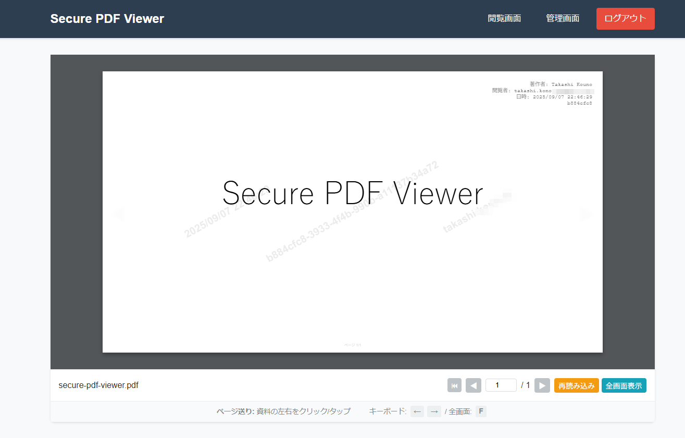

# セキュアPDF閲覧システム

## 概要

セキュアなPDF資料の限定公開・閲覧システムです。特定の人のみが指定期間内にPDF資料を閲覧可能な、企業や組織向けの機密資料管理ソリューションです。

### 主な機能
- **2段階認証**: 共有パスフレーズ + メールOTP認証
- **セキュアPDF配信**: 直接ダウンロード防止・動的ウォーターマーク付与
- **アクセス管理**: セッション管理・IP制限・地理的制限
- **管理機能**: リアルタイム監視・統計・緊急停止機能

### PDF閲覧機能



**セキュア閲覧機能:**
- **動的ウォーターマーク**: 作成者名・閲覧者情報・日時をリアルタイム表示
- **直接ダウンロード防止**: 右クリック保存・URL直叩きを完全ブロック
- **不正利用追跡**: ウォーターマーク情報による画面キャプチャ時の利用者特定
- **セッション連携**: 認証状態と完全連携した安全なPDF表示
- **レスポンシブ対応**: PC・タブレット・スマートフォンで最適表示

## 想定利用シーン

### 対象ユーザー
- **閲覧権限者**: 約30人（一般利用者）
- **管理者**: 1-3名（システム管理・監視）
- **想定同時アクセス**: 10人程度
- **対応端末数**: 45-90台（複数端末利用考慮）

### 利用想定
- 重要な企業資料の限定公開
- 役員会議資料の事前配布
- 機密情報を含む文書の安全な共有
- 期間限定の資料配布（会議前後の短期間公開）

## システム構成

### インフラ構成

**推奨: Cloudflare トンネル構成**
```
インターネット → Cloudflare トンネル → nginx → Docker（アプリケーション）
                      ↓
                    メール（OTP送信）
```

**従来: Cloudflare CDN構成**
```
インターネット → Cloudflare CDN → nginx → Docker（アプリケーション）
                     ↓
                   メール（OTP送信）
```

### 技術スタック
- **アプリケーション**: Flask (Python)
- **コンテナ化**: Docker + Docker Compose
- **データベース**: SQLite3
- **フロントエンド**: PDF.js + 独自JavaScript
- **CDN/セキュリティ**: Cloudflare
- **メール配信**: SMTP対応メールサーバー

### セキュリティ特徴
- **多層防御アーキテクチャ**: CDN・アプリ・セッション・ファイルレベル
- **Cloudflare CDNセキュリティ**: Real IP検出・リファラー検証・セキュリティヘッダー統一
- **直接ダウンロード防止**: Referrer・User-Agent・認証チェック
- **ウォーターマーク**: 動的生成・不正利用追跡
- **リアルタイム監視**: 異常アクセス検知・自動ブロック

## デプロイ方法

### 前提条件
- Docker及びDocker Composeがインストール済み
- Git が使用可能な環境
- OpenSSL または Python3 が使用可能
- SQLite3 がインストール済み（データベース管理・トラブルシューティング用）

```bash
# Ubuntu/Debian
sudo apt update && sudo apt install -y sqlite3

# CentOS/RHEL/Rocky Linux
sudo yum install -y sqlite3
# または dnf を使用
sudo dnf install -y sqlite3

# インストール確認
sqlite3 --version
```

### 開発環境セットアップ

#### Docker環境（推奨）

```bash
# リポジトリクローン
git clone <repository-url>
cd secure-pdf-viewer

# 環境変数設定
cp .env.example .env
# [重要] .env ファイルを必ず編集してください
# 特にPDF_ALLOWED_REFERRER_DOMAINSにアクセス元のIPアドレス/ネットワークを追加
# 例: PDF_ALLOWED_REFERRER_DOMAINS=localhost,127.0.0.1,192.168.0.0/16

# UID/GIDを自動設定して権限問題を回避
export UID=$(id -u)
export GID=$(id -g)

# データベース初期化・マイグレーション実行
docker-compose run --rm db-init

# 開発環境起動
docker-compose up -d

# 初期パスフレーズ設定
docker-compose exec app python scripts/setup/setup_initial_passphrase.py
```

#### Python venv環境（開発・デバッグ用）

```bash
# リポジトリクローン
git clone <repository-url>
cd secure-pdf-viewer

# Python仮想環境作成・有効化
python3 -m venv venv
source venv/bin/activate  # Linux/macOS
# または: venv\Scripts\activate  # Windows

# 依存関係インストール
pip install -r requirements.txt

# 環境変数設定
cp .env.example .env
# [重要] .env ファイルを必ず編集してください

# 必要なディレクトリ作成
mkdir -p instance logs static/pdfs

# データベース初期化
python scripts/setup/init_db.py

# 初期パスフレーズ設定
python scripts/setup/setup_initial_passphrase.py

# 開発サーバー起動
export FLASK_ENV=development
export FLASK_DEBUG=1
python app.py
# アクセス: http://localhost:5000
```

#### セットアップ完了確認（Docker環境）

```bash
echo "=== セットアップ完了確認 ==="
docker-compose ps
docker-compose exec app python -c "
import sqlite3
conn = sqlite3.connect('instance/database.db')
migrations = conn.execute('SELECT name FROM migrations ORDER BY id').fetchall()
print('適用済みマイグレーション:', [m[0] for m in migrations])
conn.close()
"

# ログ確認
docker-compose logs -f app
```

### 本番環境デプロイ

```bash
# リポジトリクローン
git clone <repository-url>
cd secure-pdf-viewer

# 本番環境用設定
cp .env.example .env
# .env を本番環境用に編集（詳細は環境変数設定を参照）

# 本番用Docker設定
sed -i 's/FLASK_ENV=development/FLASK_ENV=production/' docker-compose.yml
sed -i 's/FLASK_DEBUG=1/FLASK_DEBUG=0/' docker-compose.yml

# 必要なディレクトリ作成
mkdir -p instance logs static/pdfs backups
chmod 700 backups

# UID/GIDを自動設定して権限問題を回避
export UID=$(id -u)
export GID=$(id -g)

# データベース初期化・マイグレーション実行
docker-compose run --rm db-init

# 本番環境起動
docker-compose up -d

# 動作確認
curl -I http://localhost:5000
docker-compose ps
```

### 環境変数設定

`.env` ファイルの主要設定項目：

```bash
# Flask設定（必須）
FLASK_SECRET_KEY=$(openssl rand -hex 32)
FLASK_ENV=production  # 本番環境

# メール設定（必須）
MAIL_SERVER=your-mail-server.com
MAIL_PORT=465
MAIL_USERNAME=your-email@example.com
MAIL_PASSWORD=your-email-password

# 管理者設定（必須）
ADMIN_EMAIL=admin@example.com

# システム設定（必須）
CLOUDFLARE_DOMAIN=your-domain.com
TIMEZONE=UTC  # 本番環境推奨

# Cloudflare CDNセキュリティ設定（CDN使用時）
ENABLE_CDN_SECURITY=true
CDN_ENVIRONMENT=cloudflare
TRUST_CF_CONNECTING_IP=true
STRICT_IP_VALIDATION=true

# PDF配信セキュリティ（重要）
PDF_DOWNLOAD_PREVENTION_ENABLED=true
# [重要] PDF閲覧を許可するReferrer（必須設定）
# アクセス元のIPアドレス、ドメイン、ネットワークを指定
# 設定例: localhost,127.0.0.1,192.168.0.0/16,yourdomain.com
# 注意: この設定が正しくないとPDFが表示されません（403 Forbidden）
PDF_ALLOWED_REFERRER_DOMAINS=localhost,127.0.0.1,your-domain.com,192.168.0.0/16
PDF_USER_AGENT_CHECK_ENABLED=true
PDF_STRICT_MODE=false  # 開発環境では false 推奨
```

### Nginx設定（本番環境推奨）

#### Cloudflare トンネル環境（推奨）

Cloudflare トンネル使用時の最適化設定：

```bash
# nginx設定ファイルをコピー
sudo cp config/nginx.conf.example /etc/nginx/sites-available/secure-pdf-viewer

# 設定ファイル編集（必須）
sudo vim /etc/nginx/sites-available/secure-pdf-viewer
# - APPLICATION_HOST を実際のアプリケーションホスト:ポートに変更
# 例: APPLICATION_HOST → 192.0.2.100:5000

# 実際の設定変更例
sudo sed -i 's/APPLICATION_HOST/192.0.2.100:5000/g' /etc/nginx/sites-available/secure-pdf-viewer

# サイト有効化
sudo ln -s /etc/nginx/sites-available/secure-pdf-viewer /etc/nginx/sites-enabled/

# 設定テスト・適用
sudo nginx -t
sudo systemctl reload nginx
```

**Cloudflare トンネルの利点:**
- **SSL/TLS自動管理**: 証明書の自動取得・更新
- **外部アクセス完全制御**: トンネル経由のみアクセス可能
- **Real IP自動復元**: CF-Connecting-IPによる正確なクライアントIP
- **HTTP/2プロトコルエラー解決**: SSE(/api/events)専用のHTTP/1.1設定

#### 従来のCloudflare CDN環境

従来のCDN設定も引き続きサポート：

```bash
# 従来設定使用時は上記設定を参考に以下を追加設定
# - SSL証明書パスの設定
# - Cloudflare IP範囲の制限設定
# - HTTP→HTTPSリダイレクト設定
```

**共通セキュリティ機能:**
- **レート制限**: 認証・API・一般アクセスの段階的制限
- **PDF直リンク防止**: セキュアエンドポイント以外からのPDFアクセス禁止
- **管理画面最適化**: 大容量データ処理対応のバッファ設定

### 運用・メンテナンス

```bash
# システム停止・再起動
docker-compose down
export UID=$(id -u) GID=$(id -g)  # 権限設定を再適用
docker-compose up -d

# ログローテーション（アプリケーション）
docker-compose exec app find /app/logs -name "*.log" -type f -mtime +7 -delete

# ログローテーション（nginx - 必要に応じて）
sudo logrotate -f /etc/logrotate.d/nginx

# システム更新
docker-compose pull
docker-compose up -d --force-recreate

# バックアップ確認
ls -la backups/

# データベース状態確認
docker-compose exec app python -c "
from database.models import init_db
init_db()
print('Database initialized successfully')
"

# nginx設定確認
sudo nginx -t
sudo systemctl status nginx
```

### Cloudflare設定

#### Cloudflare トンネル設定（推奨）

**Cloudflareトンネルとは:**
- クラウドベースの安全なトンネルサービス
- 外部IPアドレス不要でWebサービスを公開可能
- SSL/TLS証明書の自動管理とDDoS攻撃からの自動保護
- ファイアウォール設定不要（アウトバウンド接続のみ）

**1. cloudflared のインストール**
```bash
# Ubuntu/Debian
wget -q https://github.com/cloudflare/cloudflared/releases/latest/download/cloudflared-linux-amd64.deb
sudo dpkg -i cloudflared-linux-amd64.deb

# CentOS/RHEL/Rocky Linux
wget -q https://github.com/cloudflare/cloudflared/releases/latest/download/cloudflared-linux-x86_64.rpm
sudo rpm -i cloudflared-linux-x86_64.rpm

# バージョン確認
cloudflared version
```

**2. Cloudflare認証**
```bash
# ブラウザでCloudflareにログインする画面が開きます
cloudflared tunnel login
# 認証が完了すると ~/.cloudflared/cert.pem が作成されます
```

**3. トンネル作成**
```bash
# トンネル作成
cloudflared tunnel create pdf-viewer

# 作成確認（UUIDを控えてください）
cloudflared tunnel list
```

**4. 設定ファイル作成**
```bash
# システム用ディレクトリ作成
sudo mkdir -p /etc/cloudflared

# 認証ファイルの配置（権限対応）
# 方法A: 一般ユーザーで認証した場合（コピーが必要）
sudo mkdir -p /root/.cloudflared
sudo cp ~/.cloudflared/cert.pem /root/.cloudflared/
sudo cp ~/.cloudflared/*.json /root/.cloudflared/

# 方法B: 最初からrootで認証する場合（コピー不要）
# sudo cloudflared tunnel login  # rootで実行すれば/root/.cloudflaredに直接作成

# 設定ファイル作成
sudo vim /etc/cloudflared/config.yml
```

**5. 設定ファイルの内容**
```yaml
# /etc/cloudflared/config.yml
tunnel: pdf-viewer
credentials-file: /root/.cloudflared/xxxxxxxx-xxxx-xxxx-xxxx-xxxxxxxxxxxx.json

ingress:
  - hostname: pdf-viewer.your-domain.com  # 実際のドメイン名に変更
    service: https://localhost:443         # nginx HTTPS環境の場合
    # service: http://localhost:80         # nginx HTTP環境の場合
    originRequest:
      httpHostHeader: pdf-viewer.your-domain.com  # 実際のドメイン名に変更
      noTLSVerify: true                            # 自己署名証明書対応
  - service: http_status:404
```

**6. DNS設定とテスト実行**
```bash
# Cloudflare DNS にトンネルルートを登録
cloudflared tunnel route dns pdf-viewer pdf-viewer.your-domain.com

# テスト実行（Ctrl+Cで停止）
sudo cloudflared tunnel --config /etc/cloudflared/config.yml run pdf-viewer
```

**7. サービス化と起動**
```bash
# サービスとして登録
sudo cloudflared service install

# 起動と自動起動設定
sudo systemctl start cloudflared
sudo systemctl enable cloudflared

# 状態確認
sudo systemctl status cloudflared
```

**8. 動作確認**
```bash
# DNS伝播確認（CNAMEレコードになっているはず）
dig pdf-viewer.your-domain.com

# アクセステスト
curl -I https://pdf-viewer.your-domain.com

# ログ確認
sudo journalctl -u cloudflared -f
```

#### 従来のCloudflare CDN設定

**DNS設定:**
1. Cloudflareダッシュボードにログイン
2. 対象ドメインを選択
3. **DNS** → **Records** で以下を設定：
   ```
   Type: A
   Name: your-domain (またはサブドメイン)
   IPv4 address: YOUR_SERVER_IP
   Proxy status: Proxied (オレンジ雲マーク)
   ```

**SSL/TLS設定:**
1. **SSL/TLS** → **Overview** で暗号化モードを設定：
   ```
   推奨: Full (strict) - 最高セキュリティ
   最小: Full - 基本セキュリティ
   ```
2. **SSL/TLS** → **Edge Certificates** で以下を有効化：
   - Always Use HTTPS: ON
   - HTTP Strict Transport Security (HSTS): ON
   - Minimum TLS Version: 1.2以上

#### 2. CDNセキュリティ機能との連携設定

**セキュリティ設定:**
1. **Security** → **Settings** で以下を設定：
   ```
   Security Level: Medium (推奨)
   Challenge Passage: 30 minutes
   Browser Integrity Check: ON
   ```

2. **Security** → **WAF** でWebアプリケーションファイアウォール設定：
   ```
   WAF: ON (Pro/Business/Enterpriseプランで利用可能)
   ```

**キャッシュ設定（重要）:**
1. **Caching** → **Configuration** で以下を設定：
   ```
   Caching Level: Standard
   Browser Cache TTL: 4 hours (デフォルト)
   ```

2. **Page Rules**で重要パスのキャッシュを制御：
   ```
   パターン: your-domain.com/secure/*
   設定: Cache Level = Bypass (セキュアPDF配信用)
   
   パターン: your-domain.com/admin*
   設定: Cache Level = Bypass (管理画面用)
   
   パターン: your-domain.com/auth/*
   設定: Cache Level = Bypass (認証用)
   ```

#### 3. 環境変数との連携

`.env`ファイルでCloudflare設定と連携：

```bash
# Cloudflareドメイン設定（必須）
CLOUDFLARE_DOMAIN=your-domain.com

# CDNセキュリティ機能有効化（必須）
ENABLE_CDN_SECURITY=true
CDN_ENVIRONMENT=cloudflare
TRUST_CF_CONNECTING_IP=true
STRICT_IP_VALIDATION=true

# PDF配信セキュリティ（Cloudflareドメイン追加）
PDF_ALLOWED_REFERRER_DOMAINS=localhost,127.0.0.1,your-domain.com,192.0.2.0/24
```

#### 4. 動作確認

**CDN機能確認:**
```bash
# 1. Real IP取得の確認
curl -H "CF-Connecting-IP: 203.0.113.1" https://your-domain.com/
# レスポンスヘッダーで "X-Real-IP-Source: CF-Connecting-IP" を確認

# 2. CDN環境識別の確認
curl -I https://your-domain.com/
# レスポンスヘッダーで "X-CDN-Environment: cloudflare" を確認

# 3. セキュリティヘッダーの確認
curl -I https://your-domain.com/admin
# 各種セキュリティヘッダーが適用されていることを確認
```

**Cloudflare機能確認:**
1. **Analytics** → **Security** でセキュリティイベントを確認
2. **Caching** → **Analytics** でキャッシュ効率を確認
3. **Speed** → **Optimization** でパフォーマンスを確認

#### 5. トラブルシューティング

**よくある問題と解決方法:**

**1. Real IPが正しく取得されない**
```bash
# 原因: Proxy statusが無効
# 解決: CloudflareダッシュボードでProxy statusを「Proxied」に設定

# 原因: CF-Connecting-IPヘッダーが届かない  
# 解決: nginx設定でreal_ip_headerを確認
# /etc/nginx/sites-available/secure-pdf-viewer で以下を確認:
# real_ip_header CF-Connecting-IP;
```

**2. PDFが403エラーで表示されない**
```bash
# 原因: リファラー検証エラー
# 解決1: .envファイルでCLOUDFLARE_DOMAINを正しく設定
echo "CLOUDFLARE_DOMAIN=your-domain.com" >> .env

# 解決2: PDF_ALLOWED_REFERRER_DOMAINSにCloudflareドメインを追加
echo "PDF_ALLOWED_REFERRER_DOMAINS=localhost,127.0.0.1,your-domain.com" >> .env

# アプリケーション再起動
docker-compose down && docker-compose up -d
```

**3. 管理画面が表示されない**  
```bash
# 原因: Page Rulesのキャッシュ設定
# 解決: Cloudflareダッシュボードで以下のPage Ruleを追加:
# パターン: your-domain.com/admin*
# 設定: Cache Level = Bypass
```

**4. SSL証明書エラー**
```bash
# 原因: SSL/TLS暗号化モードの設定不備
# 解決: CloudflareでSSL/TLS暗号化モードを「Full (strict)」に設定
# 注意: サーバー側に有効なSSL証明書が必要
```

**5. 外部からの直接アクセスが遮断されない**
```bash
# 原因: nginx設定のCloudflare IP範囲が古い
# 解決: 最新のCloudflare IP範囲を確認・更新
curl https://www.cloudflare.com/ips-v4
curl https://www.cloudflare.com/ips-v6

# nginx設定ファイル更新後
sudo nginx -t && sudo systemctl reload nginx
```

**ログ確認コマンド:**
```bash
# アプリケーションログ
docker-compose logs -f app

# nginxログ
sudo tail -f /var/log/nginx/secure-pdf-viewer-access.log
sudo tail -f /var/log/nginx/secure-pdf-viewer-error.log

# Cloudflareログ（ダッシュボード）
# Analytics → Security Events で確認
```

## トラブルシューティング

### よくある問題

**PDFが表示されない（403 Forbidden エラー）** *** 最重要 ***
```bash
# 原因: PDF_ALLOWED_REFERRER_DOMAINSの設定不備
# 解決方法:
# 1. .envファイルでアクセス元IPアドレスを追加
echo "PDF_ALLOWED_REFERRER_DOMAINS=localhost,127.0.0.1,192.0.2.0/24" >> .env

# 2. 環境変数変更後は必ず再起動（restartでは不十分）
docker-compose down && docker-compose up -d

# 3. 設定確認
docker-compose exec app printenv | grep PDF_ALLOWED_REFERRER_DOMAINS
```

**管理画面でPDFファイルリストが表示されない**
```bash
# 原因: データベースマイグレーション未実行
# 解決方法:
docker-compose exec app python -c "
from database.migrations import run_all_migrations
import sqlite3
conn = sqlite3.connect('instance/database.db')
run_all_migrations(conn)
conn.close()
print('マイグレーション完了')
"

# アプリケーション再起動
docker-compose restart app
```

**ポート競合エラー**
```bash
netstat -tulpn | grep :5000
# 必要に応じてdocker-compose.ymlのポート設定変更
```

**データベースエラー**
```bash
docker-compose run --rm db-init
```

**環境変数が反映されない**
```bash
# .env変更後はrestartではなく down/up が必要
docker-compose down && docker-compose up -d
```

**メール送信エラー**
```bash
# .envのメール設定を確認
docker-compose logs app | grep -i mail
```

## ドキュメント

詳細な技術仕様・設計については、以下のドキュメントを参照してください：

### 主要設計書
- **[システム全体仕様](./docs/specifications.md)** - 全体アーキテクチャ・機能要件
- **[セキュリティ設計](./docs/security-design-philosophy.md)** - セキュリティアーキテクチャ・脅威対策
- **[PDF配信アーキテクチャ](./docs/pdf-delivery-architecture.md)** - PDF配信・保護機能

### 機能別設計書
- **[認証・セッション管理](./docs/session-management-features.md)** - 認証フロー・セッション設計
- **[管理者権限システム](./docs/admin-permission-system-design.md)** - 管理機能・権限管理
- **[バックアップシステム](./docs/backup-system-design.md)** - データバックアップ・復旧
- **[監視・アラート](./docs/monitoring-alert-system-design.md)** - 監視機能・通知システム
- **[レート制限](./docs/rate-limiting-system-design.md)** - アクセス制御・DoS対策
- **[ログ・監査](./docs/security-event-logging-design.md)** - セキュリティログ・監査機能
- **[Cloudflare CDNセキュリティ](./docs/cloudflare-cdn-security-design.md)** - CDN環境セキュリティ設計

### 実装ガイド
- **[PDF直接ダウンロード防止](./docs/pdf-download-prevention-implementation.md)** - 実装詳細
- **[ウォーターマーク機能](./docs/watermark-enhancement-implementation.md)** - 実装・運用
- **[タイムゾーン統一](./docs/timezone-unification-system-design.md)** - 時刻管理統一
- **[レスポンシブUI](./docs/responsive-ui-improvement-design.md)** - UI/UX改善

### 運用ガイド
- **[緊急停止機能](./docs/emergency-stop-feature.md)** - 緊急対応手順
- **[インシデント検索](./docs/incident-search-functionality-design.md)** - ログ分析・調査
- **[Cloudflare CDNセットアップ](./docs/cloudflare-cdn-setup.md)** - CDN環境構築・運用

## ライセンス

[LICENSE](./LICENSE) を参照してください。

## サポート

技術的な問題や質問については、プロジェクト管理者にお問い合わせください。

