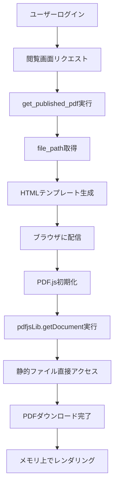
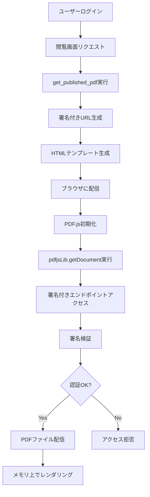

# PDF配信アーキテクチャドキュメント

**作成日**: 2025-07-23  
**バージョン**: 1.0  
**関連TASK**: [TASK-009](../tickets/tasks/TASK-009.md)

## 概要

本ドキュメントでは、セキュアPDF閲覧システムにおけるPDFファイル配信の技術アーキテクチャと、署名付きURL実装による安全性強化について詳述する。

## 現在の配信アーキテクチャ

### システム構成
```
ブラウザ ←→ Flaskアプリケーション ←→ SQLiteデータベース
   ↓
静的ファイル（/static/pdfs/）
```

### 問題点
- **直接アクセス可能**: `/static/pdfs/filename.pdf` で認証バイパス
- **ダウンロード可能**: ブラウザから直接保存可能
- **セキュリティホール**: セッション認証が完全に無効化される

## PDF.js統合と配信メカニズム

### PDF.jsの動作原理

PDF.jsは**クライアントサイドPDFレンダリングライブラリ**で、以下の特徴を持つ：

1. **全データ取得**: `pdfjsLib.getDocument(url)` 実行時にPDFファイル全体をダウンロード
2. **メモリ処理**: ダウンロード後はブラウザメモリ上でページ処理
3. **単発アクセス**: 初回ロード時のみURLアクセス、以降は再アクセスなし

### 現在の配信フロー



**脆弱性**: ステップIで認証チェックが完全にバイパスされる

## 署名付きURL配信アーキテクチャ

### セキュリティ強化後の配信フロー



### 技術コンポーネント

#### 1. 署名付きURL生成機能
```python
def generate_signed_pdf_url(filename, session_id, expires_in_hours=72):
    """
    HMAC-SHA256署名付きURLを生成
    
    Args:
        filename: PDFファイル名
        session_id: セッションID
        expires_in_hours: 有効期限（時間）
    
    Returns:
        str: 署名付きURL
    """
    expiration = int(time.time()) + (expires_in_hours * 3600)
    
    # 署名対象データ
    message = f"{filename}:{session_id}:{expiration}"
    
    # HMAC署名生成
    signature = hmac.new(
        SECRET_KEY.encode(),
        message.encode(),
        hashlib.sha256
    ).hexdigest()
    
    # URL構築
    return f"/secure/pdf/{signature}?f={filename}&s={session_id}&exp={expiration}"
```

#### 2. 署名検証・配信エンドポイント
```python
@app.route('/secure/pdf/<signature>')
def serve_secure_pdf(signature):
    """
    署名付きURL経由でのPDF配信
    
    1. URL署名検証
    2. セッション認証確認
    3. 期限チェック
    4. ファイル配信
    """
    filename = request.args.get('f')
    session_id = request.args.get('s')
    expiration = request.args.get('exp', type=int)
    
    # 署名検証
    if not verify_pdf_url_signature(signature, filename, session_id, expiration):
        abort(403)
    
    # セッション認証確認
    if not session.get('authenticated'):
        abort(401)
    
    # 期限チェック
    if time.time() > expiration:
        abort(410)  # Gone
    
    # ファイル配信
    return send_file(get_pdf_path(filename))
```

#### 3. 静的ファイルアクセス無効化
```python
# Flaskアプリケーション設定
app = Flask(__name__, static_folder=None)  # 静的フォルダを無効化

# または nginx設定でブロック
location /static/pdfs/ {
    return 403;
}
```

## セキュリティ特性

### 1. 改ざん検知
- **HMAC-SHA256署名**: URLパラメータの改ざんを検知
- **メッセージ認証**: filename, session_id, expirationの整合性保証

### 2. 時間制限
- **72時間有効期限**: セッション有効期限と同期
- **期限切れ自動無効**: タイムスタンプベースの厳密な期限管理

### 3. セッション連動
- **認証状態確認**: `session['authenticated']` 必須
- **セッション無効化連動**: 管理者による強制ログアウト時に即座無効

### 4. ログ・監視
```python
# アクセスログ記録
def log_pdf_access(session_id, filename, signature_valid, access_result):
    """PDF アクセスの詳細ログを記録"""
    conn = sqlite3.connect('instance/database.db')
    cursor = conn.cursor()
    
    cursor.execute('''
        INSERT INTO access_logs 
        (session_id, endpoint, pdf_filename, signature_valid, access_result, timestamp)
        VALUES (?, ?, ?, ?, ?, ?)
    ''', (session_id, '/secure/pdf/', filename, signature_valid, access_result, datetime.now()))
    
    conn.commit()
    conn.close()
```

## 実装上の考慮事項

### 1. PDF.js互換性
- **透過性**: PDF.jsから見ると通常のURLと同様
- **エラーハンドリング**: 署名エラー時の適切なエラーレスポンス
- **CORS対応**: 必要に応じてCORS設定

### 2. パフォーマンス
- **署名生成コスト**: HMAC-SHA256は軽量で高速
- **ファイルI/O**: Flask `send_file()` による効率的配信
- **キャッシュ戦略**: CDN無効化（セキュリティ優先）

### 3. スケーラビリティ
- **秘密鍵管理**: 環境変数による安全な管理
- **負荷分散**: 複数インスタンス間での鍵共有
- **ログ容量**: PDF アクセスログの適切なローテーション

## 運用・保守

### 1. 監視項目
- **不正アクセス試行**: 署名検証失敗の頻度
- **期限切れアクセス**: 期限切れURL使用の検知
- **異常パターン**: 同一IPからの大量リクエスト

### 2. トラブルシューティング
```bash
# 署名検証失敗の調査
grep "signature_verification_failed" /var/log/secure-pdf-viewer.log

# 不正アクセス分析
SELECT ip_address, COUNT(*) as attempts 
FROM access_logs 
WHERE signature_valid = 0 
GROUP BY ip_address 
ORDER BY attempts DESC;
```

### 3. 設定パラメータ
| パラメータ | デフォルト値 | 説明 |
|-----------|-------------|------|
| `pdf_url_expiry_hours` | 72 | URL有効期限（時間） |
| `signed_url_secret` | - | HMAC署名用秘密鍵 |
| `pdf_access_rate_limit` | 10/min | 同一IPからのアクセス制限 |
| `signature_validation_strict` | true | 厳密な署名検証モード |

## トークン設計と可視性について

### トークンの構造と情報の透明性

現在の実装では、署名付きURLトークンはBase64エンコードされたクエリパラメータを含んでおり、以下の情報が可視状態となっている：

```bash
# トークンのデコード例
$ echo "Zj03ZDA4YzVhOWQ0YjM0ODE3YmM4NGE3ZjVjNDFhNWJjMS5wZGYmZXhwPTE3NTM1MDYyMDUmc2lkPThlM2Q4YzUxLTdmNDAtNDhlNS1hOTQwLWU0MTA1YzRhMWUyMSZzaWc9NTA5OTgxM2FiOTFlMzQ4MDBhZjFhMmQxMGZjMTVlMGQ3ZGY5MmU3ZTkyZTJmZDc4ZWUxNTAyMjIxMmQ1MTlkNQ" | base64 -d

# 出力:
f=7d08c5a9d4b34817bc84a7f5c41a5bc1.pdf&exp=1753506205&sid=8e3d8c51-7f40-48e5-a940-e4105c4a1e21&sig=5099813ab91e34800af1a2d10fc15e0d7df92e7e92e2fd78ee15022212d519d5
```

#### 可視パラメータ：
- **📄 ファイル名**: `7d08c5a9d4b34817bc84a7f5c41a5bc1.pdf`
- **⏰ 有効期限**: `1753506205` (Unix timestamp)
- **🔑 セッションID**: `8e3d8c51-7f40-48e5-a940-e4105c4a1e21`
- **✍️ 署名**: `5099813ab91e34800af1a2d10fc15e0d...`

### 設計判断の理由

#### ✅ **透明性重視の設計思想**

1. **デバッグ容易性**
   - 開発・運用時の問題調査が迅速
   - ログ解析時にパラメータが明確
   - 技術サポート時の効率的な問題特定

2. **標準的実装パターン**
   - JWT (JSON Web Tokens) 等の業界標準も同様の構造
   - OAuth 2.0 のアクセストークンも情報が可視
   - セキュリティコミュニティで確立された手法

3. **クライアント側検証**
   ```javascript
   // 有効期限をJS側で事前チェック可能
   function isTokenExpired(token) {
       const decoded = atob(token);
       const params = new URLSearchParams(decoded);
       const expiry = parseInt(params.get('exp'));
       return Date.now() / 1000 > expiry;
   }
   ```

4. **監査・コンプライアンス対応**
   - アクセスログ解析時にパラメータが明確
   - セキュリティ監査での透明性確保
   - インシデント調査時の迅速な原因特定

#### 🔒 **実際のセキュリティ保証**

**重要**: 情報が見える ≠ セキュリティが弱い

```python
# 署名生成プロセス（秘密鍵が必要）
def generate_signature(filename, expiry, session_id, one_time=False):
    sign_string = f"{filename}:{expiry}:{session_id}:{str(one_time).lower()}"
    return hmac.new(
        SECRET_KEY.encode('utf-8'),
        sign_string.encode('utf-8'), 
        hashlib.sha256
    ).hexdigest()
```

- **セッションIDが判明**: しかし他人のセッションは使用不可（サーバー側で照合）
- **有効期限が判明**: しかし延長は署名なしには不可能
- **ファイル名が判明**: しかし署名なしには別ファイルアクセス不可
- **署名が判明**: しかし秘密鍵なしには新しい署名生成不可

### セキュリティ類推例

| システム | 可視情報 | セキュリティ保証 |
|---------|---------|----------------|
| **銀行OTP** | 6桁の数字が見える | タイムベース生成で改ざん不可 |
| **航空券** | 便名・座席が印字 | 偽造防止技術で保護 |
| **SSL証明書** | 発行者・有効期限が可視 | デジタル署名で完全性保証 |
| **署名付きURL** | パラメータが可視 | HMAC署名で改ざん不可 |

### 代替設計案との比較

#### 不透明トークン方式（検討したが採用しなかった理由）

```python
# 代替案：完全不透明トークン
{
    "token": "k8h2j9d5f7g3s1a4z6x8c9v2b7n4m1q5",  # ランダム文字列
    "server_storage": {  # Redis/DBに保存
        "k8h2j9d5f7g3s1a4z6x8c9v2b7n4m1q5": {
            "filename": "document.pdf",
            "session_id": "session-123",
            "expires_at": "2025-07-26T14:00:00Z"
        }
    }
}
```

**利点**:
- ✅ 完全に不透明（情報が見えない）
- ✅ より高い秘匿性
- ✅ 即座なトークン無効化が可能

**欠点**:
- ❌ サーバー側ストレージ必要（Redis/DB）
- ❌ ステートフル（スケーラビリティに影響）
- ❌ デバッグ・監査が複雑
- ❌ インフラコストの増加
- ❌ 単一障害点の増加

### AES256暗号化の検討と却下理由

#### 暗号化が不要な判断根拠

```
┌─────────────────────────────────────────────────────────────┐
│ 🎯 脅威モデル分析                                             │
├─────────────────────────────────────────────────────────────┤
│ シナリオ           │ AES256効果 │ 現実的脅威度 │ 現在の対策    │
├─────────────────────────────────────────────────────────────┤
│ URLが盗聴される    │ 🔒内容隠蔽 │ 🟢低(HTTPS)  │ TLS暗号化     │
│ ログが漏洩する     │ 🔒SID隠蔽  │ 🟡中         │ アクセス制御   │
│ 攻撃者が解析する   │ 🔒解読困難 │ 🟢低         │ 署名改ざん不可 │
│ 内部関係者の悪用   │ 🔒一時隠蔽 │ 🔴高         │ 鍵アクセス不可 │
└─────────────────────────────────────────────────────────────┘
```

#### 暗号化導入のデメリット

1. **複雑性の増大**
   ```python
   # 現在（シンプル）
   def verify_token(token):
       decoded = base64.decode(token)
       return verify_hmac_signature(decoded)
   
   # AES256追加（複雑）
   def verify_encrypted_token(token):
       decoded = base64.decode(token)
       decrypted = aes256_decrypt(decoded, key)  # 鍵管理必要
       return verify_hmac_signature(decrypted)
   ```

2. **鍵管理の負担**
   - 暗号化鍵の安全な保存（HSM、Key Vault等）
   - 定期的な鍵ローテーション
   - 複数サーバー間での鍵同期
   - 鍵漏洩時の全トークン無効化

3. **パフォーマンス影響**
   - 暗号化/復号化のCPU負荷
   - レスポンス時間の増加
   - メモリ使用量の増加

#### 暗号化が必要なケース

```
🔒 AES256暗号化が推奨される環境:
├─ 超機密文書（軍事、医療、金融等）
├─ 法規制要求（GDPR、HIPAA等の明示要求）
├─ ゼロトラスト環境（内部ネットワークも信頼しない）
└─ コンプライアンス要件（監査で暗号化が必須）

🎯 現在のシステム（一般的企業利用）:
├─ 通常のビジネス文書配信 ✅
├─ HTTPS通信環境 ✅
├─ 信頼できる運用環境 ✅
└─ コスト効率重視 ✅
```

### セキュリティエンジニアリングの原則

#### **適切なセキュリティレベルの選択**

```
🎯 セキュリティの本質:
「脅威に対して適切なレベルの対策を、
 コスト効率よく実装すること」

❌ 過剰なセキュリティの弊害:
├─ 複雑性による新たな脆弱性の導入
├─ 運用コストの増大
├─ パフォーマンスの劣化
└─ 保守性の低下

✅ 適切なバランス（現在の実装）:
├─ 脅威モデルに対する十分な防御
├─ 透明性による運用・監査の容易さ
├─ 標準的な実装パターンの採用
└─ 拡張性・保守性の確保
```

## まとめ

署名付きURL実装により、以下のセキュリティ強化が実現される：

1. **直接アクセス防止**: 静的ファイルへの認証バイパス不可
2. **時間制限**: 72時間の厳密な期限管理
3. **改ざん検知**: HMAC署名による完全性保証
4. **セッション連動**: 認証状態との完全同期
5. **監査ログ**: 全アクセスの詳細記録

**設計哲学**: パラメータの可視性は「透明性と堅牢性のバランス」を重視した適切な設計判断である。情報が見えることとセキュリティの強度は独立した概念であり、現在の実装は業界標準に準拠した、運用・保守・監査に優れたソリューションを提供する。

この実装により、PDF.jsの利便性を保ちながら、エンタープライズレベルのセキュリティを実現する。