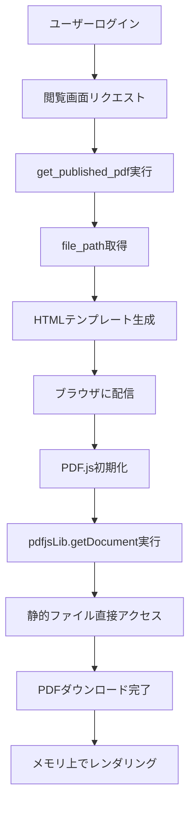
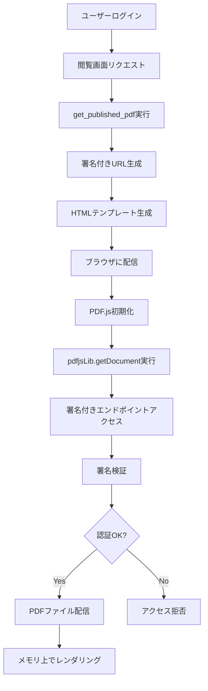

# PDF配信アーキテクチャドキュメント

**作成日**: 2025-07-23  
**バージョン**: 1.0  
**関連TASK**: [TASK-009](../tickets/tasks/TASK-009.md)

## 概要

本ドキュメントでは、セキュアPDF閲覧システムにおけるPDFファイル配信の技術アーキテクチャと、署名付きURL実装による安全性強化について詳述する。

## 現在の配信アーキテクチャ

### システム構成
```
ブラウザ ←→ Flaskアプリケーション ←→ SQLiteデータベース
   ↓
静的ファイル（/static/pdfs/）
```

### 問題点
- **直接アクセス可能**: `/static/pdfs/filename.pdf` で認証バイパス
- **ダウンロード可能**: ブラウザから直接保存可能
- **セキュリティホール**: セッション認証が完全に無効化される

## PDF.js統合と配信メカニズム

### PDF.jsの動作原理

PDF.jsは**クライアントサイドPDFレンダリングライブラリ**で、以下の特徴を持つ：

1. **全データ取得**: `pdfjsLib.getDocument(url)` 実行時にPDFファイル全体をダウンロード
2. **メモリ処理**: ダウンロード後はブラウザメモリ上でページ処理
3. **単発アクセス**: 初回ロード時のみURLアクセス、以降は再アクセスなし

### 現在の配信フロー



**脆弱性**: ステップIで認証チェックが完全にバイパスされる

## 署名付きURL配信アーキテクチャ

### セキュリティ強化後の配信フロー



### 技術コンポーネント

#### 1. 署名付きURL生成機能
```python
def generate_signed_pdf_url(filename, session_id, expires_in_hours=72):
    """
    HMAC-SHA256署名付きURLを生成
    
    Args:
        filename: PDFファイル名
        session_id: セッションID
        expires_in_hours: 有効期限（時間）
    
    Returns:
        str: 署名付きURL
    """
    expiration = int(time.time()) + (expires_in_hours * 3600)
    
    # 署名対象データ
    message = f"{filename}:{session_id}:{expiration}"
    
    # HMAC署名生成
    signature = hmac.new(
        SECRET_KEY.encode(),
        message.encode(),
        hashlib.sha256
    ).hexdigest()
    
    # URL構築
    return f"/secure/pdf/{signature}?f={filename}&s={session_id}&exp={expiration}"
```

#### 2. 署名検証・配信エンドポイント
```python
@app.route('/secure/pdf/<signature>')
def serve_secure_pdf(signature):
    """
    署名付きURL経由でのPDF配信
    
    1. URL署名検証
    2. セッション認証確認
    3. 期限チェック
    4. ファイル配信
    """
    filename = request.args.get('f')
    session_id = request.args.get('s')
    expiration = request.args.get('exp', type=int)
    
    # 署名検証
    if not verify_pdf_url_signature(signature, filename, session_id, expiration):
        abort(403)
    
    # セッション認証確認
    if not session.get('authenticated'):
        abort(401)
    
    # 期限チェック
    if time.time() > expiration:
        abort(410)  # Gone
    
    # ファイル配信
    return send_file(get_pdf_path(filename))
```

#### 3. 静的ファイルアクセス無効化
```python
# Flaskアプリケーション設定
app = Flask(__name__, static_folder=None)  # 静的フォルダを無効化

# または nginx設定でブロック
location /static/pdfs/ {
    return 403;
}
```

## セキュリティ特性

### 1. 改ざん検知
- **HMAC-SHA256署名**: URLパラメータの改ざんを検知
- **メッセージ認証**: filename, session_id, expirationの整合性保証

### 2. 時間制限
- **72時間有効期限**: セッション有効期限と同期
- **期限切れ自動無効**: タイムスタンプベースの厳密な期限管理

### 3. セッション連動
- **認証状態確認**: `session['authenticated']` 必須
- **セッション無効化連動**: 管理者による強制ログアウト時に即座無効

### 4. ログ・監視
```python
# アクセスログ記録
def log_pdf_access(session_id, filename, signature_valid, access_result):
    """PDF アクセスの詳細ログを記録"""
    conn = sqlite3.connect('instance/database.db')
    cursor = conn.cursor()
    
    cursor.execute('''
        INSERT INTO access_logs 
        (session_id, endpoint, pdf_filename, signature_valid, access_result, timestamp)
        VALUES (?, ?, ?, ?, ?, ?)
    ''', (session_id, '/secure/pdf/', filename, signature_valid, access_result, datetime.now()))
    
    conn.commit()
    conn.close()
```

## 実装上の考慮事項

### 1. PDF.js互換性
- **透過性**: PDF.jsから見ると通常のURLと同様
- **エラーハンドリング**: 署名エラー時の適切なエラーレスポンス
- **CORS対応**: 必要に応じてCORS設定

### 2. パフォーマンス
- **署名生成コスト**: HMAC-SHA256は軽量で高速
- **ファイルI/O**: Flask `send_file()` による効率的配信
- **キャッシュ戦略**: CDN無効化（セキュリティ優先）

### 3. スケーラビリティ
- **秘密鍵管理**: 環境変数による安全な管理
- **負荷分散**: 複数インスタンス間での鍵共有
- **ログ容量**: PDF アクセスログの適切なローテーション

## 運用・保守

### 1. 監視項目
- **不正アクセス試行**: 署名検証失敗の頻度
- **期限切れアクセス**: 期限切れURL使用の検知
- **異常パターン**: 同一IPからの大量リクエスト

### 2. トラブルシューティング
```bash
# 署名検証失敗の調査
grep "signature_verification_failed" /var/log/secure-pdf-viewer.log

# 不正アクセス分析
SELECT ip_address, COUNT(*) as attempts 
FROM access_logs 
WHERE signature_valid = 0 
GROUP BY ip_address 
ORDER BY attempts DESC;
```

### 3. 設定パラメータ
| パラメータ | デフォルト値 | 説明 |
|-----------|-------------|------|
| `pdf_url_expiry_hours` | 72 | URL有効期限（時間） |
| `signed_url_secret` | - | HMAC署名用秘密鍵 |
| `pdf_access_rate_limit` | 10/min | 同一IPからのアクセス制限 |
| `signature_validation_strict` | true | 厳密な署名検証モード |

## まとめ

署名付きURL実装により、以下のセキュリティ強化が実現される：

1. **直接アクセス防止**: 静的ファイルへの認証バイパス不可
2. **時間制限**: 72時間の厳密な期限管理
3. **改ざん検知**: HMAC署名による完全性保証
4. **セッション連動**: 認証状態との完全同期
5. **監査ログ**: 全アクセスの詳細記録

この実装により、PDF.jsの利便性を保ちながら、エンタープライズレベルのセキュリティを実現する。