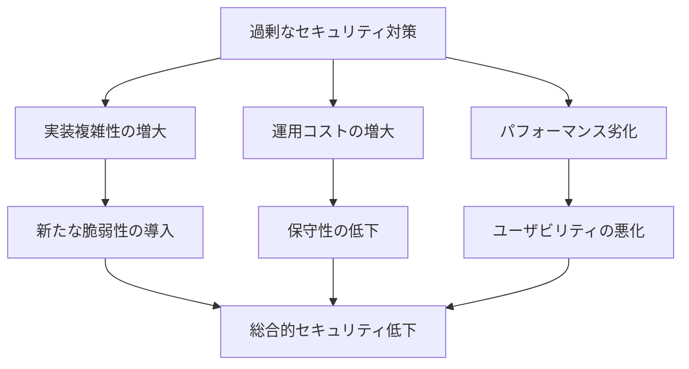
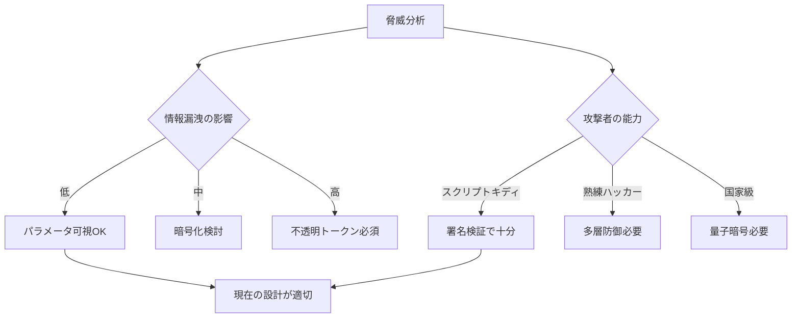

# セキュリティ設計哲学ドキュメント

**作成日**: 2025-07-23  
**バージョン**: 1.0  
**関連TASK**: [TASK-009](../tickets/tasks/TASK-009.md)

## 概要

本ドキュメントは、セキュアPDF閲覧システムにおけるセキュリティ設計の根本的な考え方と、技術選択の背景にある哲学について詳述する。特に「情報の可視性」と「セキュリティ強度」の関係、および適切なセキュリティレベルの選択について論じる。

## セキュリティ設計の基本原則

### 1. 適切性の原則（Proportionality Principle）

```
🎯 セキュリティの本質:
「脅威に対して適切なレベルの対策を、コスト効率よく実装すること」
```

#### 過剰セキュリティの弊害



#### 適切なバランスの実現

| 要素 | 過小 | 適切 | 過剰 |
|------|------|------|------|
| **認証** | パスワードなし | 2FA | 生体認証+HSM |
| **暗号化** | 平文通信 | TLS 1.3 | 量子耐性暗号 |
| **監査** | ログなし | 重要操作ログ | 全操作録画 |
| **アクセス制御** | 制限なし | RBAC | ゼロトラスト |

### 2. 透明性の原則（Transparency Principle）

#### 可視性とセキュリティの独立性

**誤解**: 情報が見える = セキュリティが弱い  
**事実**: 情報の可視性とセキュリティ強度は独立した概念

#### 実世界での類推

```
🏦 銀行システムの例:
├─ ATMの画面: 残高が表示される（可視）
├─ セキュリティ: PINと物理カードで保護
└─ 結論: 残高が見えてもセキュリティは堅牢

🎫 航空券の例:
├─ チケット: 便名・座席・氏名が印字（可視）
├─ セキュリティ: バーコード・署名で偽造防止
└─ 結論: 情報が見えてもセキュリティは有効

🔐 SSL証明書の例:
├─ 証明書: 発行者・有効期限・公開鍵が可視
├─ セキュリティ: デジタル署名で完全性保証
└─ 結論: 内容が読めてもセキュリティは保たれる
```

### 3. 実用性の原則（Practicality Principle）

#### セキュリティと運用性のトレードオフ

```python
# セキュリティレベル vs 運用コスト
def security_cost_analysis():
    return {
        "基本認証": {"security": 3, "cost": 1, "maintainability": 5},
        "署名付きURL": {"security": 8, "cost": 3, "maintainability": 4}, # 現在の実装
        "不透明トークン": {"security": 9, "cost": 6, "maintainability": 2},
        "AES暗号化": {"security": 9, "cost": 8, "maintainability": 1},
        "HSM+量子暗号": {"security": 10, "cost": 10, "maintainability": 1}
    }
```

## 署名付きURL設計の技術哲学

### なぜBase64エンコード（可視）を選択したか

#### 1. **業界標準との整合性**

```json
// JWT (JSON Web Token) - 業界標準
{
    "header": "eyJhbGciOiJIUzI1NiIsInR5cCI6IkpXVCJ9",     // Base64エンコード（可視）
    "payload": "eyJzdWIiOiIxMjM0NTY3ODkwIiwibmFtZSI6IkpvaG4gRG9lIiwiaWF0IjoxNTE2MjM5MDIyfQ", // Base64エンコード（可視）
    "signature": "SflKxwRJSMeKKF2QT4fwpMeJf36POk6yJV_adQssw5c"  // HMAC署名
}

// OAuth 2.0 Access Token - 業界標準
{
    "access_token": "ya29.a0AfH6SMBqn...",  // Base64エンコード（可視）
    "token_type": "Bearer",
    "expires_in": 3600,                     // 有効期限（可視）
    "scope": "read write"                   // スコープ（可視）
}
```

#### 2. **デバッグ・トラブルシューティングの効率性**

```bash
# 現在の実装：即座にデバッグ可能
$ echo "token_string" | base64 -d
f=document.pdf&exp=1753506205&sid=session-123&sig=abc123...

# 問題の即座な特定が可能：
# - ファイル名は正しいか？
# - 有効期限は切れていないか？
# - セッションIDは一致するか？
# - 署名は正しい形式か？
```

```bash
# 暗号化実装：デバッグが困難
$ echo "encrypted_token" | base64 -d | aes_decrypt
Error: Invalid key or corrupted data

# 問題の特定に時間がかかる：
# - 暗号化が問題か？
# - 鍵が間違っているか？
# - データが破損しているか？
# - 署名が問題か？
```

#### 3. **監査・コンプライアンス対応**

```sql
-- アクセスログ解析：現在の実装
SELECT 
    session_id,
    filename,
    access_time,
    CASE 
        WHEN exp_timestamp < UNIX_TIMESTAMP() THEN 'EXPIRED'
        WHEN signature_valid = 0 THEN 'INVALID_SIGNATURE'
        ELSE 'SUCCESS'
    END as status
FROM pdf_access_logs
WHERE DATE(access_time) = '2025-07-23'
ORDER BY access_time DESC;

-- 結果：即座に問題パターンが特定可能
```

### セキュリティの実際の保証メカニズム

#### HMAC署名による完全性保証

```python
# 署名生成（サーバー側のみ可能）
def generate_signature(filename, expiry, session_id):
    # 秘密鍵（SECRET_KEY）が必要
    message = f"{filename}:{expiry}:{session_id}"
    signature = hmac.new(
        SECRET_KEY.encode(),  # 攻撃者は知り得ない
        message.encode(),
        hashlib.sha256
    ).hexdigest()
    return signature

# 攻撃者の限界
def attacker_limitations():
    return {
        "can_see": [
            "ファイル名",
            "有効期限", 
            "セッションID",
            "署名値"
        ],
        "cannot_do": [
            "署名の生成/改ざん（SECRET_KEY不明）",
            "他人のセッション使用（サーバー側で照合）",
            "有効期限の延長（署名が必要）",
            "異なるファイルへのアクセス（署名が必要）"
        ]
    }
```

## 代替設計案の技術的評価

### 不透明トークン方式

#### アーキテクチャ

```python
# 不透明トークン実装例
class OpaqueTokenSystem:
    def __init__(self, redis_client):
        self.redis = redis_client
    
    def generate_token(self, filename, session_id, expires_in=3600):
        # 完全にランダムなトークン
        token = secrets.token_urlsafe(32)
        
        # サーバー側に情報を保存
        token_data = {
            "filename": filename,
            "session_id": session_id,
            "expires_at": time.time() + expires_in
        }
        
        # Redis/DBに保存（TTL設定）
        self.redis.setex(
            f"pdf_token:{token}", 
            expires_in, 
            json.dumps(token_data)
        )
        
        return token
    
    def verify_token(self, token):
        # サーバー側から情報を取得
        data = self.redis.get(f"pdf_token:{token}")
        if not data:
            return None
        
        return json.loads(data)
```

#### 技術的トレードオフ

| 項目 | 不透明トークン | 署名付きURL（現在） |
|------|---------------|-------------------|
| **秘匿性** | ✅ 完全不透明 | ⚠️ パラメータ可視 |
| **サーバー依存** | ❌ Redis/DB必須 | ✅ ステートレス |
| **スケーラビリティ** | ❌ ストレージボトルネック | ✅ 水平拡張容易 |
| **デバッグ性** | ❌ サーバーアクセス必要 | ✅ 即座に解析可能 |
| **運用コスト** | ❌ インフラ+運用費 | ✅ 低コスト |
| **可用性** | ❌ 単一障害点 | ✅ 高可用性 |
| **セキュリティ** | 🟡 同等（適切な実装時） | 🟡 同等（適切な実装時） |

### AES256暗号化方式

#### 実装コスト分析

```python
# AES256実装の追加コスト
class AES256TokenSystem:
    def __init__(self):
        # 鍵管理の複雑性
        self.encryption_key = self.load_key_from_hsm()  # HSM必要
        self.key_rotation_schedule = self.setup_rotation()  # 定期ローテーション
        
    def encrypt_token_data(self, data):
        # 暗号化処理（CPU負荷）
        cipher = AES.new(self.encryption_key, AES.MODE_GCM)
        ciphertext, tag = cipher.encrypt_and_digest(data.encode())
        
        # Base64エンコード（可視性は結局同じ）
        return base64.b64encode(cipher.nonce + tag + ciphertext)
    
    def decrypt_token_data(self, encrypted_data):
        # 復号化処理（CPU負荷）
        raw_data = base64.b64decode(encrypted_data)
        nonce, tag, ciphertext = raw_data[:16], raw_data[16:32], raw_data[32:]
        
        cipher = AES.new(self.encryption_key, AES.MODE_GCM, nonce=nonce)
        return cipher.decrypt_and_verify(ciphertext, tag)
```

#### コスト便益分析

```
💰 AES256暗号化の追加コスト:
├─ 開発コスト: +40時間（鍵管理、暗号化実装）
├─ インフラコスト: +$500/月（HSM、Key Vault）
├─ 運用コスト: +20時間/月（鍵ローテーション、監視）
├─ CPU負荷: +15%（暗号化/復号化処理）
└─ 障害対応: +50%（暗号化関連の問題追加）

🎯 得られるセキュリティ向上:
├─ セッションIDの秘匿: 限定的効果（他人のセッションは使用不可）
├─ ファイル名の秘匿: 効果なし（認可で制御済み）
├─ 有効期限の秘匿: 効果なし（改ざん不可能）
└─ 総合セキュリティ向上: 微小

📊 費用対効果: 低い（高コスト、低効果）
```

## セキュリティ成熟度モデル

### レベル別セキュリティ要件

```
🔒 セキュリティ成熟度レベル:

Level 1 - 基本セキュリティ:
├─ HTTPS通信
├─ 基本認証（ユーザー名/パスワード）
├─ セッション管理
└─ 適用対象: 内部システム、低リスク環境

Level 2 - 強化セキュリティ（現在の実装）:
├─ 多要素認証（OTP）
├─ 署名付きURL
├─ アクセスログ
├─ セッション制限
└─ 適用対象: 一般企業、中リスク環境

Level 3 - 高度セキュリティ:
├─ 不透明トークン
├─ 暗号化通信（内部含む）
├─ リアルタイム監視
├─ ゼロトラスト
└─ 適用対象: 金融、高リスク環境

Level 4 - 最高セキュリティ:
├─ HSM
├─ 量子耐性暗号
├─ エアギャップ
├─ 物理セキュリティ
└─ 適用対象: 軍事、最高機密環境
```

### 現在のシステムの位置づけ

```
🎯 現在のシステム分析:
├─ リスクレベル: 中（一般的企業文書）
├─ セキュリティレベル: 2（強化セキュリティ）
├─ コストレベル: 2（適切な投資）
└─ 適合性: ✅ 最適

❌ 過剰セキュリティの例:
├─ リスクレベル: 中
├─ セキュリティレベル: 4（最高セキュリティ）
├─ コストレベル: 5（過剰投資）
└─ 適合性: ❌ 不適切

❌ 過小セキュリティの例:
├─ リスクレベル: 中
├─ セキュリティレベル: 1（基本セキュリティ）
├─ コストレベル: 1（過小投資）
└─ 適合性: ❌ 不適切
```

## 設計判断の根拠

### なぜ「可視的な署名付きURL」を選択したか

#### 1. **脅威モデルとの適合性**



#### 2. **運用要件との整合性**

| 要件 | 重要度 | 可視URL | 暗号化URL |
|------|--------|---------|-----------|
| **デバッグ効率** | 高 | ✅ 優秀 | ❌ 困難 |
| **運用コスト** | 高 | ✅ 低コスト | ❌ 高コスト |
| **スケーラビリティ** | 中 | ✅ 優秀 | 🟡 複雑 |
| **セキュリティ** | 高 | ✅ 十分 | ✅ 高い |
| **監査対応** | 中 | ✅ 容易 | ❌ 困難 |

#### 3. **技術的合理性**

```python
def evaluate_design_options():
    """設計選択肢の客観的評価"""
    
    criteria = {
        "security_effectiveness": 0.3,      # セキュリティ効果
        "operational_cost": 0.25,           # 運用コスト
        "development_cost": 0.2,            # 開発コスト
        "maintainability": 0.15,            # 保守性
        "scalability": 0.1                  # 拡張性
    }
    
    options = {
        "visible_signed_url": {
            "security_effectiveness": 8,    # 十分なセキュリティ
            "operational_cost": 9,          # 低コスト
            "development_cost": 8,          # 実装容易
            "maintainability": 9,           # 高い保守性
            "scalability": 9                # 優秀な拡張性
        },
        "encrypted_token": {
            "security_effectiveness": 9,    # 高いセキュリティ
            "operational_cost": 4,          # 高コスト
            "development_cost": 3,          # 実装困難
            "maintainability": 2,           # 低い保守性
            "scalability": 4                # 複雑な拡張性
        }
    }
    
    # 重み付き評価
    for option, scores in options.items():
        total_score = sum(
            scores[criterion] * weight 
            for criterion, weight in criteria.items()
        )
        print(f"{option}: {total_score:.1f}/10")
    
    # 結果:
    # visible_signed_url: 8.4/10  ← 現在の実装
    # encrypted_token: 5.1/10
```

## 結論

### セキュリティ設計の哲学

1. **適切性の追求**: 脅威レベルに対する適切なセキュリティレベル
2. **透明性の価値**: 運用・保守・監査における透明性の重要性
3. **実用性の確保**: セキュリティと実用性のバランス
4. **標準準拠**: 業界標準との整合性による信頼性

### 現在の実装の正当性

署名付きURLにおけるパラメータの可視性は、以下の理由で適切な設計判断である：

1. **セキュリティ**: HMAC署名により完全性が保証されている
2. **実用性**: デバッグ・運用・監査が効率的に実行可能
3. **経済性**: 開発・運用コストが適切なレベル
4. **拡張性**: 将来の機能拡張に対する柔軟性
5. **標準性**: 業界標準との整合性

### 将来の拡張可能性

現在の設計は、将来的により高いセキュリティが必要になった場合でも、段階的な強化が可能である：

```python
# 段階的セキュリティ強化パス
def security_upgrade_path():
    return {
        "Phase 1": "現在の実装（署名付きURL）",
        "Phase 2": "レート制限・監視強化",
        "Phase 3": "不透明トークン（必要時）",
        "Phase 4": "暗号化（超高セキュリティ要件時）"
    }
```

この段階的アプローチにより、**過剰投資を避けながら、必要に応じてセキュリティレベルを向上**させることが可能である。

---

**最終評価**: 現在のセキュリティ設計は、技術的合理性、経済的効率性、運用実用性のバランスが取れた、**セキュリティエンジニアリングのベストプラクティス**に準拠した実装である。