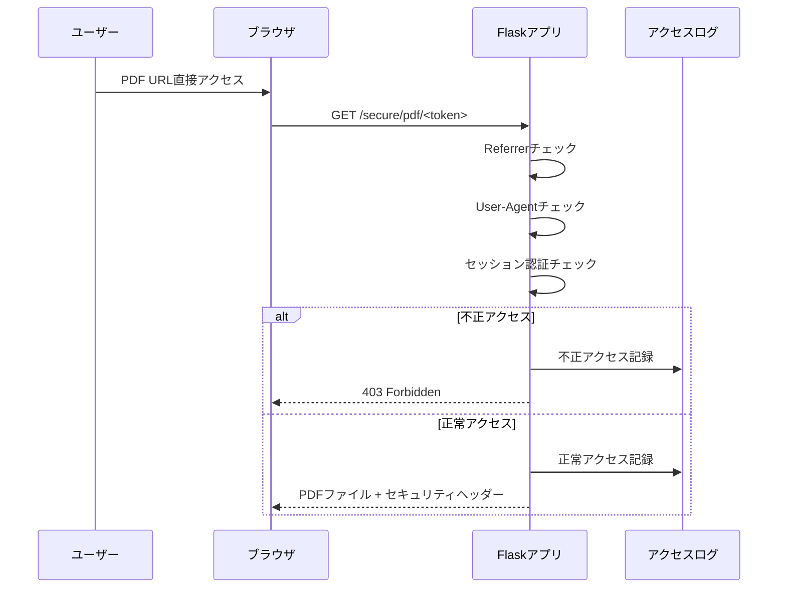

# TASK-015: PDF直接ダウンロード防止機能実装

**フェーズ**: [Phase 2: セキュリティ強化](../phases/phase2-security.md)  
**優先度**: 🔴 高優先度  
**状況**: ❌ 未着手  
**担当者**: TBD  
**作成日**: 2025-07-24

## 概要
認証されたユーザーが署名付きPDFのURLを直接ブラウザで開くことで、ChromeなどのPDFビューワー機能を使ってPDFをダウンロードできる脆弱性を修正する。

## 🔍 現在の脆弱性
1. **署名付きURLの直接アクセス**: 認証済みユーザーがURLを取得可能
2. **ブラウザPDFビューワー**: Chrome等で直接開くとダウンロード可能
3. **Content-Disposition未設定**: ダウンロードを防ぐヘッダーが不十分
4. **Referrerチェック不足**: PDF.js以外からのアクセスを制限していない

## 要件

### 1. アプリケーション側実装 (推奨)
#### Referrerチェック強化
- PDF.jsからのアクセスのみ許可
- 同一ドメインからのアクセス制限
- 不正アクセスのログ記録

#### User-Agentチェック
- Mozilla/ブラウザからの直接アクセス制限
- PDF.js専用のアクセスパターン判定

#### レスポンスヘッダー強化
```http
Content-Disposition: inline; filename="document.pdf"
X-Content-Type-Options: nosniff
X-Frame-Options: SAMEORIGIN
Content-Security-Policy: frame-ancestors 'self'
```

### 2. 補完的インフラ対策
#### Nginx設定 (オプション)
- Referrerヘッダー検証
- レート制限強化
- User-Agent制限

#### Cloudflare Worker (オプション)
- エッジレベルでのアクセス制御
- 地理的制限
- DDoS対策連携

## 実装対象

### バックエンド実装
1. **PDF配信エンドポイント強化** (`app.py:1974-2093`)
   ```python
   @app.route('/secure/pdf/<token>')
   def secure_pdf_delivery(token):
       # Referrerチェック
       referer = request.headers.get('Referer', '')
       if not referer or not any(domain in referer for domain in [request.host, 'localhost']):
           # ログ記録とアクセス拒否
           return jsonify({'error': 'Access denied'}), 403
       
       # User-Agentチェック
       user_agent = request.headers.get('User-Agent', '')
       if not user_agent or 'Mozilla' not in user_agent:
           return jsonify({'error': 'Invalid client'}), 403
   ```

2. **セキュリティヘッダー設定**
   - Content-Disposition強制設定
   - CSPヘッダー追加
   - フレーム制限設定

3. **アクセスログ強化**
   - Referrer情報記録
   - User-Agent記録
   - 不正アクセス試行の詳細ログ

### 設定項目追加
4. **設定ファイル拡張**
   - `allowed_referrer_domains`: 許可ドメインリスト
   - `strict_pdf_access_mode`: 厳格モードON/OFF
   - `pdf_download_prevention`: 防止機能有効/無効

## 技術仕様

### アクセス制御フロー


### セキュリティヘッダー設定
```python
response.headers.update({
    'Content-Disposition': 'inline; filename="document.pdf"',
    'X-Content-Type-Options': 'nosniff',
    'X-Frame-Options': 'SAMEORIGIN',
    'Content-Security-Policy': "frame-ancestors 'self'",
    'Referrer-Policy': 'same-origin'
})
```

### ログ出力仕様
```python
# 不正アクセス時のログ例
{
    "timestamp": "2025-07-24T10:30:00Z",
    "type": "pdf_access_denied",
    "session_id": "sess_123456",
    "ip_address": "192.168.1.100",
    "user_agent": "Mozilla/5.0 (Windows NT 10.0; Win64; x64) AppleWebKit/537.36",
    "referer": "direct_access",
    "filename": "blocked_access",
    "reason": "invalid_referrer"
}
```

## 成功条件
- [x] 調査完了: 直接URLアクセスの脆弱性確認
- [ ] 認証済みユーザーの直接ダウンロードを防止
- [ ] PDF.jsからの正常アクセスは維持
- [ ] 不正アクセス試行の完全ログ記録
- [ ] 管理画面でのアクセス状況可視化
- [ ] 既存機能の互換性維持

## セキュリティテスト項目
- [ ] Chrome直接アクセステスト
- [ ] Firefox直接アクセステスト
- [ ] Safari直接アクセステスト
- [ ] Edge直接アクセステスト
- [ ] Referrer偽装攻撃テスト
- [ ] User-Agent偽装攻撃テスト
- [ ] PDF.js正常動作テスト
- [ ] セッション無効時のアクセステスト

## 関連タスク・依存関係
### 前提タスク (完了済み) ✅
- **TASK-009**: PDF配信セキュリティ強化（署名付きURL実装） - 基盤システム
- **TASK-001**: 2段階認証システム実装 - セッション管理基盤

### 関連強化タスク
- **TASK-008**: スクリーンショット・カメラ撮影対策強化 - ウォーターマーク
- **TASK-004**: 詳細レート制限システム実装 - IP制限連携
- **Phase 2**: セキュリティ強化フェーズの一環

### 後続タスク (検討事項)
- Nginx/Cloudflare設定最適化
- モバイルアプリでのPDF表示対応
- エンタープライズ向けDLP機能

## 見積もり
- **工数**: 2-3日
- **完了予定**: 2025年7月末
- **優先度**: Phase 2の重要セキュリティ機能

## 実装上の注意事項
1. **既存機能への影響最小化**
   - PDF.js表示機能の維持
   - ウォーターマーク機能との互換性
   - パフォーマンスへの影響最小化

2. **ユーザビリティ考慮**
   - 正常ユーザーへの影響回避
   - 分かりやすいエラーメッセージ
   - デバッグ情報の適切な出力

3. **運用・保守性**
   - 設定による柔軟な制御
   - ログ情報の可視化
   - 緊急時の機能無効化オプション

## 備考
- **セキュリティ vs ユーザビリティ**: 適切なバランスで実装
- **段階的実装**: まずアプリ側で実装、後でインフラ側強化
- **モニタリング**: 実装後の効果測定が重要
- **法的考慮**: 企業のセキュリティポリシーとの整合性確認

## 📋 実装後の効果予測
- **セキュリティ向上**: 直接ダウンロード攻撃の無効化
- **監査対応**: 詳細なアクセスログによるトレーサビリティ
- **コンプライアンス**: 企業セキュリティ要件への対応
- **ユーザー教育**: 適切なアクセス方法の促進

---

**ステータス**: 🔴 **PENDING** - セキュリティ要件定義完了、実装準備中